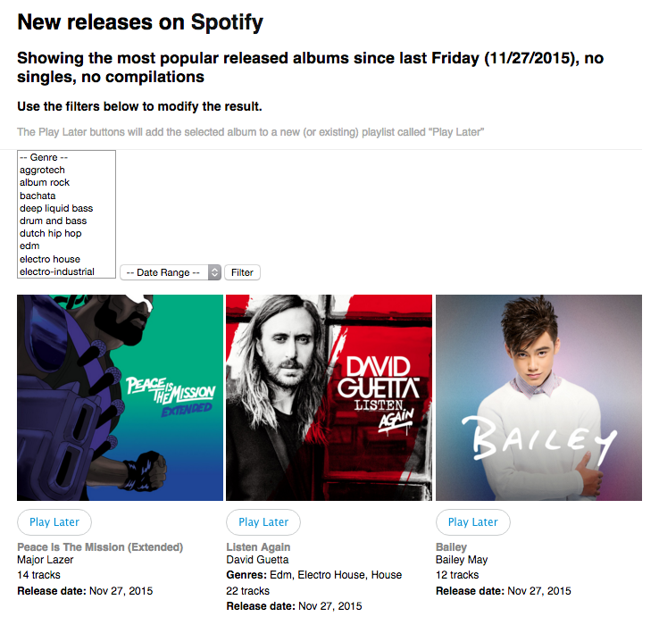

| Tables        | Are           | Cool  |
| ------------- |:-------------:| -----:|
| col 3 is      | right-aligned | $1600 |
| col 2 is      | centered      |   $12 |
| zebra stripes | are neat      |    $1 |

Please note, this repo has not been abandonned. Development is ongoing, but the codebase is unstable due to changes to the API and new integrations with Spotify and Last.fm. It is my intention to wrap these together and push them up here once I am able to package everything so it's able to be replicated on another environment. 

-Mike Garrett, Feb 10, 2016

[](https://codeclimate.com/github/MikeNGarrett/Play-Later) [](https://codeclimate.com/github/MikeNGarrett/Play-Later)

------------------- 

# Play Later for Spotify

Replicating Rdio functionality for finding new releases and adding them to your queue and implementing it with the Spotify API.

h/t http://spotifyreleases.com/ for the original code

## Word of Warning

This is very, very much a work-in-progress. I have made every attempt to solidify the database structure and file structure before deploying to Github, but they can still change.

Use at your own risk!

## Requirements

* Tested using PHP 5.5 and MySQL 5.6.
* Requires at least PHP 5.4 and MySQL 5.5.
* Recommended that you have command line access and ability to create cron jobs.
* Excited to use [PHPFastCache](https://github.com/khoaofgod/phpfastcache) for plug-and-play caching

## Installation

You need a mysql database and [Spotify app](https://developer.spotify.com/my-applications/#!/applications/create) before you begin.

Add your mysql connection details to `config.php`

Add your Spotify API credentials to `spotify-config.php` including full redirect and callback URIs.

Finally, run the following commands via the command line to ingest the initial data set:
```
$ php cron/cron.php
$ php cron/get_album_art.php
$ php cron/update_popularity.php
```

If you're running locally change into the cron directory to run the tasks and remove cron/ and run the commands above.

You should add these three commands as cron tasks to keep your data up to date.

First, run `$ crontab -e` then enter the following:
```
# Run every night at midnight
00 00 * * * cd /path/to/cron/; php cron.php >> /path/to/log/play-later-cron.log
# Run every night at 1 AM
00 01 * * * cd /path/to/cron/; php get_album_art.php >> /path/to/log/play-later-get-art.log
# Run every night at 2 AM
00 02 * * * cd /path/to/cron/; php update_popularity.php >> /path/to/log/play-later-update-popularity.log
```

## Usage

Working example: http://redgarrett.com/lab/play-later/



The index.php in your web root displays a list of releases for the current week (since last Friday) in order of popularity with some filters.

Clicking `Log In` signs you in to Spotify and delivers you back to the list.

A `Play Later` playlist is created in Spotify and Play Later buttons are added beneath each album.

Clicking on `Play Later` adds the album listed above to your playlist. The playlist also keeps a record of what you have saved already, displaying these greyed out in the list.

Filters exist for genres (may take a bit to populate all) and date ranges for this week, last week, and two weeks ago.

Output it limited to 100 per page. Pagination works by increasing and decreasing offset by multiples of 100.

## Support

Please [open an issue](https://github.com/MikeNGarrett/Play-Later/issues/new) for support.

## Contributing

Please contribute using [Github Flow](https://guides.github.com/introduction/flow/). Create a branch, add commits, and [open a pull request](https://github.com/MikeNGarrett/Play-Later/compare/).

# License

The code is available under the [MIT license](LICENSE.txt).
